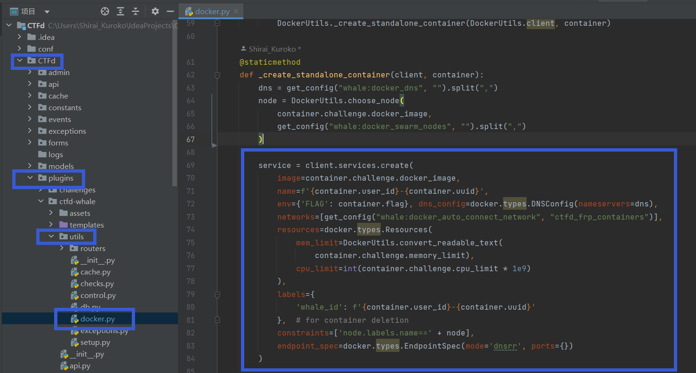
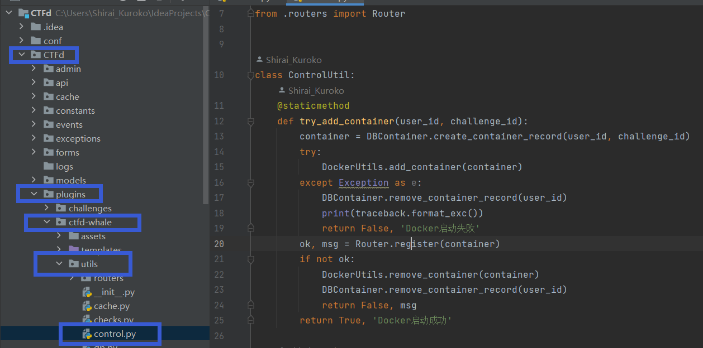

众所周知，CTFd-Whale会按照题目中设置的镜像名称去创建题目容器，然而在前端返回创建成功后，可能等了很长时间都没有创建成功，去后台一查，诶您猜怎么着，服务器没镜像！

按理说他是应该自动拉取镜像的，所以找下问题所在吧。



也就是说，whale插件是创建了一个服务，由这个服务的task来创建容器docker。

那么Whale是如何判断创建是否成功的呢？



创建失败的条件是添加容器时报错/注册路由时失败。

那么问题就来了，既然镜像没拉下来，为什么不报错呢？

很遗憾，第一张图片中

```python
client.services.create(
            image=container.challenge.docker_image,
            name=f'{container.user_id}-{container.uuid}',
            env={'FLAG': container.flag}, dns_config=docker.types.DNSConfig(nameservers=dns),
            networks=[get_config("whale:docker_auto_connect_network", "ctfd_frp_containers")],
            resources=docker.types.Resources(
                mem_limit=DockerUtils.convert_readable_text(
                    container.challenge.memory_limit),
                cpu_limit=int(container.challenge.cpu_limit * 1e9)
            ),
            labels={
                'whale_id': f'{container.user_id}-{container.uuid}'
            },  # for container deletion
            constraints=['node.labels.name==' + node],
            endpoint_spec=docker.types.EndpointSpec(mode='dnsrr', ports={})
        )
```

会自动拉取镜像，但是并不会在拉取失败时报错，这也就导致CTFd在服务创建完成时认为容器创建成功，于是去注册路由，给前端返回一个根本不能用的链接。。。。

解决这个问题的方法也很简单，我们在执行这个操作之前添加几行代码：

```python
try:
    image = client.images.get(container.challenge.docker_image)
except Exception as e:
    print(e)
    client.api.pull(container.challenge.docker_image)
```

首先根据题目的镜像名称，查询是否存在这个镜像，如果存在则跳过这段代码直接去创建镜像。

如果镜像不存在，函数会抛出异常 **docker.errors.ImageNotFound**代码进入异常处理，执行拉取镜像操作，如果这时拉取仍然失败，pull函数会抛出**docker.errors.APIError**，然后异常会抛出给上层创建容器的函数，提示创建失败，移除docker记录。此时service尚未创建，移除record也不会产生幽灵容器（幽灵容器的处理见我另一篇文章）。

这样这个问题就解决啦。
