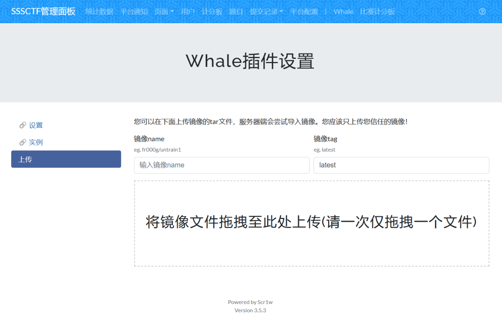

CTFd Whale提供的动态容器类型的题目是通过镜像名称创建service进而创建题目实例的，但是如果题目镜像并没有上传的dockerhub（比如只有题目的tar文件），或者题目更新了，这时候如果我们想要更新/创建题目就需要手动进入服务器上传镜像或者用tag进行区分，很是麻烦。为了解决这个问题，我们就给whale加点功能吧。

## 更新镜像

首先就是更新镜像的功能，我们直接在前端题目页面增加一个更新镜像的按钮：

在\CTFd\plugins\ctfd-whale\assets\update.html中修改以下内容

```jinja2


    <div class="form-group">
        <label for="value">Docker镜像<br>
            <small class="form-text text-muted">
                用来部署的docker镜像名称
            </small>
        </label>
        <div style="display: flex;gap: 10px;">
            <input type="text" class="form-control" name="docker_image" placeholder="输入镜像名称" id="docker_name_input"
                   required value="{{ challenge.docker_image }}" style="flex: 1;">
            <button class="btn btn-success btn-outlined" type="button" onclick="UpdateDockerImage()" style="flex: none;">
                更新镜像
            </button>
        </div>
    </div>
```

然后在update.js里写以下函数（至于为什么用CTFd.fetch，之后再说）

```js
function UpdateDockerImage(){
    var name = document.getElementById("docker_name_input").value;
    var url = "/plugins/ctfd-whale/admin/image-update?name=" + name;

    CTFd.fetch(url, {
        method: 'GET',
        credentials: 'same-origin',
        headers: {
            'Accept': 'application/json',
        }
    }).then(function (response) {
        if (response.status === 429) {
            // User was ratelimited but process response
            return response.json();
        }
        if (response.status === 403) {
            // User is not logged in or CTF is paused.
            return response.json();
        }
        return response.json();
    }).then(function (response) {
        if (response.success) {
            var e = new Object;
            e.title = "更新成功！";
            e.body = "镜像更新完成！";
            CTFd.ui.ezq.ezToast(e)
        } else {
            var e = new Object;
            e.title = "更新失败！";
            e.body = response.message;
            CTFd.ui.ezq.ezToast(e)
        }
    });
}
```

接下来在后端（\CTFd\plugins\ctfd-whale\\__init__.py）中注册路由

```python
@page_blueprint.route("/admin/image-update")
@admins_only
def admin_image_update():
    try:
        # 获取GET请求中的name参数
        name = request.args.get('name')
        DockerUtils.client.api.pull(name)
        # 返回HTTP状态码200
        print("[CTFd Whale] " + name + "镜像更新成功")
        return {
                   'success': True,
                   'message': '镜像更新完成'
               }, 200
    except Exception as e:
        print("[CTFd Whale] " + name + "镜像更新失败")
        print(e)
        return {
                   'success': False,
                   'message': '镜像更新出错：<br>' + str(e.__cause__)
               }, 200
```

这样更新镜像的功能就写完了。

## 上传镜像

接下来就是上传镜像的功能了，先写一个简单的上传页面。

在Whale的Templates目录下创建whale_upload.html，记得也在别的页面修改导航栏哦。(extend那些渲染标记省略了，对号入座就行)

```jinja2


<li class="nav-item">
    <a class="nav-link" href="/plugins/ctfd-whale/admin/settings">🔗 设置</a>
</li>
<li class="nav-item">
    <a class="nav-link" href="/plugins/ctfd-whale/admin/containers">🔗 实例</a>
</li>
<li class="nav-item">
    <a class="nav-link active" href="#">上传</a>
</li>

```
```jinja2

<div>
    <div class="form-group" id="drop">
        <p>您可以在下面上传镜像的tar文件，服务器端会尝试导入镜像。您应该只上传您信任的镜像！</p>
        <div class="form-group">
            <div style="display: flex;gap: 10px;">
                <div style="flex: 1;">
                    <label for="value">镜像name<br>
                        <small class="form-text text-muted">
                            eg. fr000g/untrain1
                        </small>
                    </label>
                    <input type="text" class="form-control" name="docker_image_name" id="docker_image_name"
                           placeholder="输入镜像name" id="docker_name_input" required="" value="">
                </div>
                <div style="flex: 1;">
                    <label for="value">镜像tag<br>
                        <small class="form-text text-muted">
                            eg. latest
                        </small>
                    </label>
                    <input type="text" class="form-control" name="docker_image_tag" id="docker_image_tag"
                           placeholder="输入镜像tag" id="docker_tag_input" required="" value="latest">
                </div>
            </div>
        </div>
        <div class="drop-area" ondragover="event.preventDefault()" ondrop="handleDrop(event)"
             style="border: 2px dashed #ccc;padding: 20px;text-align: center;height: 200px;display: flex;align-items: center;justify-content: center;">
            <div class="centered-content"
                 style="display: flex;flex-direction: column;align-items: center;justify-content: center;height: 100%;">
                <h2>将镜像文件拖拽至此处上传(请一次仅拖拽一个文件)</h2>
            </div>
        </div>
    </div>
</div>

```
```js
    <script>
        function handleDrop(event) {
            event.preventDefault();
            if (docker_image_name.value=="")
            {
                var e = new Object;
                e.title = "警告";
                e.body = "未设置镜像name";
                e.button="知道了";
                CTFd.ui.ezq.ezAlert(e)
                return;
            }
            if (docker_image_tag.value=="")
            {
                var e = new Object;
                e.title = "警告";
                e.body = "未设置镜像tag";
                e.button="知道了";
                CTFd.ui.ezq.ezAlert(e)
                return;
            }
            var files = event.dataTransfer.files;
            var progressBarContainer = document.getElementById("drop");
            var file = files[0];
            var progressBar = createProgressBar(progressBarContainer);
            var fileNameElement = document.createElement('div');
            fileNameElement.classList.add('file-name');
            fileNameElement.textContent = file.name;
            fileNameElement.style = "margin-bottom: 5px;"
            progressBarContainer.appendChild(fileNameElement);
            uploadFile(file, progressBar, fileNameElement);
        }

        function createProgressBar(progressBarContainer) {
            var progressBar = document.createElement('div');
            progressBar.classList.add('progress-bar');
            progressBar.style = "width: 100%;background-color: #f5f5f5;border-radius: 4px;overflow: hidden;margin-bottom: 10px;margin-top: 5px;"

            var progress = document.createElement('div');
            progress.classList.add('progress');
            progress.style = "width: 0;height: 20px;background-color: #4caf50;transition: width 0.3s ease-in-out;"

            progressBar.appendChild(progress);
            progressBarContainer.appendChild(progressBar);

            return progressBar;
        }

        function updateProgress(progressBar, percent) {
            progressBar.getElementsByClassName('progress')[0].style.width = percent + '%';
        }

        function uploadFile(file, progressBar, fileNameElement) {
            var formData = new FormData();
            formData.append('image', file);
            formData.append("nonce", init.csrfNonce);

            $.ajax({
                url: '/plugins/ctfd-whale/admin/upload?name='+encodeURIComponent(docker_image_name.value)+'&tag='+encodeURIComponent(docker_image_tag.value),
                type: 'POST',
                headers: {
                    "Accept": "application/json; charset=utf-8"
                },
                data: formData,
                processData: false,
                contentType: false,
                xhr: function () {
                    var xhr = new window.XMLHttpRequest();
                    xhr.upload.addEventListener('progress', function (event) {
                        if (event.lengthComputable) {
                            var percent = Math.round((event.loaded / event.total) * 100);
                            progressBar.getElementsByClassName('progress')[0].style.width = percent + '%';
                        }
                    }, false);
                    return xhr;
                },
                success: function (response) {
                    fileNameElement.remove();
                    progressBar.remove();
                    docker_image_name.value="";
                    var e = new Object;
                    e.title = "上传成功！";
                    e.body = "镜像上传完成！";
                    CTFd.ui.ezq.ezToast(e)
                },
                error: function (xhr, status, error) {
                    fileNameElement.remove();
                    progressBar.remove();
                    var e = new Object;
                    e.title = "上传失败！";
                    e.body = JSON.parse(xhr.responseText).message;
                    e.button="知道了";
                    CTFd.ui.ezq.ezAlert(e)
                }
            });
        }
    </script>
```

至于为什么css混一起写，emmm，懒了，应该提取出来的实际上。

那就有人问了，你咋不用CTFd.fetch了呢？这就涉及到一个坑爹的地方了：

CTFd.fetch表面上看起来可以用来Post发送文件，他也确实发送了，但是flask的后端接收不到任何文件,request.files直接是空的！

浏览器抓包发现，发送的数据包的content-type是application/json，而这个type是在代码里强行设置的，自定义无效，这就导致flask无法正确接受。然后用ajax吧，会直接403，这是由于flask的csrf防御措施需要一个token，源代码如下：

```python
@app.before_request
def csrf():
    try:
        func = app.view_functions[request.endpoint]
    except KeyError:
        abort(404)
    if hasattr(func, "_bypass_csrf"):
        return
    if request.headers.get("Authorization"):
        return
    if not session.get("nonce"):
        session["nonce"] = generate_nonce()
    if request.method not in ("GET", "HEAD", "OPTIONS", "TRACE"):
        if request.content_type == "application/json":
            if session["nonce"] != request.headers.get("CSRF-Token"):
                abort(403)
        if request.content_type != "application/json":
            if session["nonce"] != request.form.get("nonce"):
                abort(403)
```

所以说，如果是json那就写一个csrf-token的header，否则就在form里加上nonce名称的token，这个token可以在init.csrfNonce里拿到。

接下来就是后台的处理了,还是在init.py里：

```python
@page_blueprint.route("/admin/upload", methods=['GET', 'POST'])
@admins_only
def admin_upload_image():
    if request.method == 'POST':
        name = request.args.get("name")
        if not name:
            return {
                       'success': False,
                       'message': '缺少参数'
                   }, 400
        tag = request.args.get("tag")
        if not tag:
            return {
                       'success': False,
                       'message': '缺少参数'
                   }, 400
        # 检查文件是否存在于请求中
        if 'image' not in request.files:
            return {
                       'success': False,
                       'message': '镜像文件不存在'
                   }, 500
        file = request.files['image']
        # 如果用户未选择文件，浏览器也可能提交一个空的 part
        if file.filename == '':
            return {
                       'success': False,
                       'message': '镜像文件为空'
                   }, 500
        if file:
            try:
                filepath = os.path.join(app.config['UPLOAD_FOLDER'], file.filename)
                file.save(filepath)
                print("[CTFd Whale] 上传的镜像文件 " + name + ":" + tag + " 保存至：" + filepath)
                try:
                    image_info = DockerUtils.client.images.get(name + ":" + tag)
                    DockerUtils.client.api.remove_image(name + ":" + tag)
                except Exception as e:
                    pass
                DockerUtils.client.api.import_image_from_file(filepath, repository=name, tag=tag)
                print("[CTFd Whale] " + name + ":" + tag + "导入完成")
                # 删除上传的文件
                os.remove(filepath)
                return {
                           'success': True,
                           'message': '镜像上传完成'
                       }, 200
            except Exception as e:
                print(e)
                return {
                           'success': False,
                           'message': '镜像加载失败<br>' + str(e)
                       }, 500

    return render_template("whale_upload.html")
```

至于为什么要先获取镜像再删除，是因为docker-py如果不指定name和tag是不会自动识别的，会成为none；另外如果加载时有同名同tag镜像，原先的镜像的name和tag都会被变成none，会产生镜像垃圾。
效果如下

好的，完活，下机！

PS：我们Scr1w战队二次开发的CTFd整合版地址：https://github.com/dlut-sss/CTFD-Public

